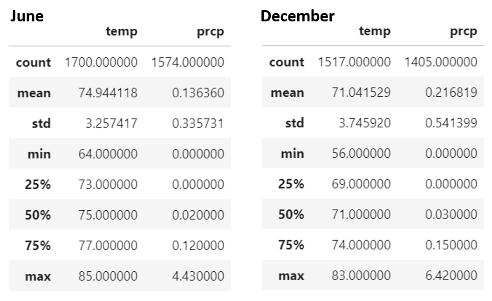

# surfs_up
Module 09 of UofT Data Analytics Boot Camp

### Objective
To analyze the seasonable weather data to assess the Impact of Seasonality on Surfing & Ice Cream Business in Oahu.

### Key Differences Between June and December
The tables below shows the key statistics data of temperature and precipitation in June and December.
Key findings are;
* No siginificant difference observed for temperature.

* Average temperature is about 71 to 75 °Fahrenheit and maximum temperature is 83 to 85 °Fahrenheit, which would be ideal temperature for both surfing and eating ice cream.

* However, the data indicates that it would rain more in December (Avg. Prcp = 0.22) than June (Avg. Prcp = 0.14), which would reduce the surfing activities and consumption of ice cream.

* In addition, the high standard deviation of precipitation in December indicates the unstable weather (strong rains etc).

### Recommendation for Further Analysis

1. Length of the rainly season: Data indicates more rains in December or likely Winter Season. The length of the rainly season, which is likely the low revenue period of the year would be a key indicater for required cash, alternate business etc.

2. Long-term Trend of Weather: Long-term trend of both temperature and precipiration would be important informationn to answer question like "Could issues like Global Warming impact the suring in dustry in Hawaii?". This is also important as we only conducted the analysis for last year and we could be capturing the data of irregular weather.

3. Weather by Location: As location of the stations are available, we could look into if the location has any impact to the temperature or precipitation. (As Hawaii is not a big island, this may not have the impact)

4. Obtain Other Data: Information such as No. of tourists by season/month, location of the hotels, and etc could be combined with the weather data to conduct more in-depth analysis. For example, even if it rains during December, there could potentially be more tourists during new year vacation from Asian region etc.